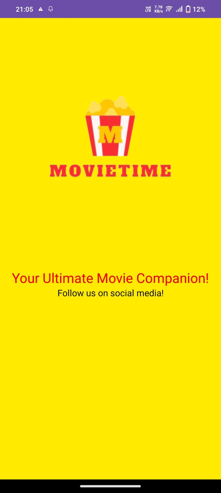
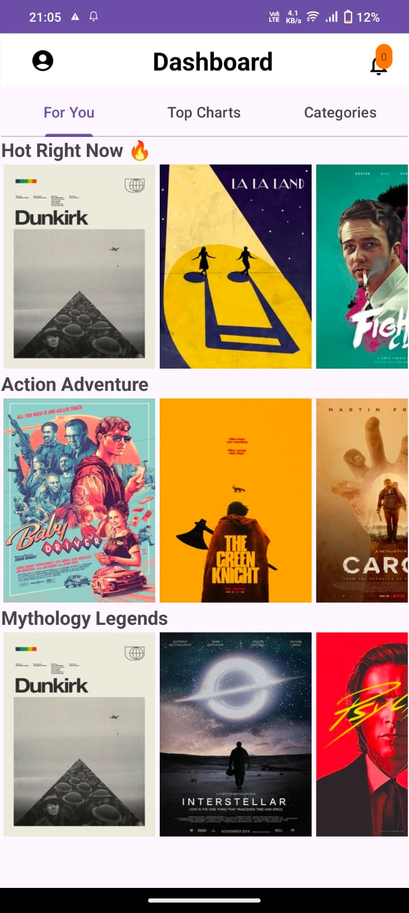
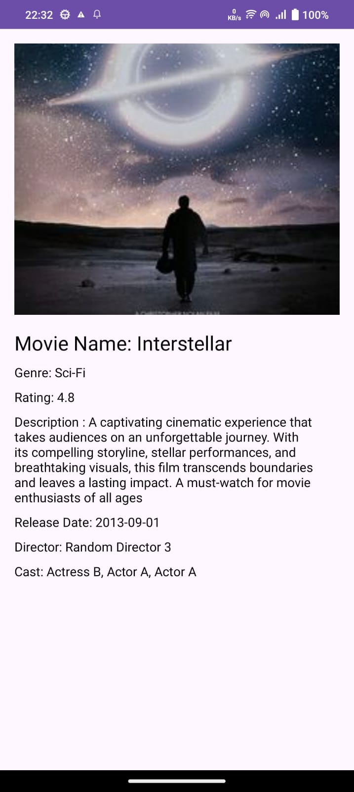
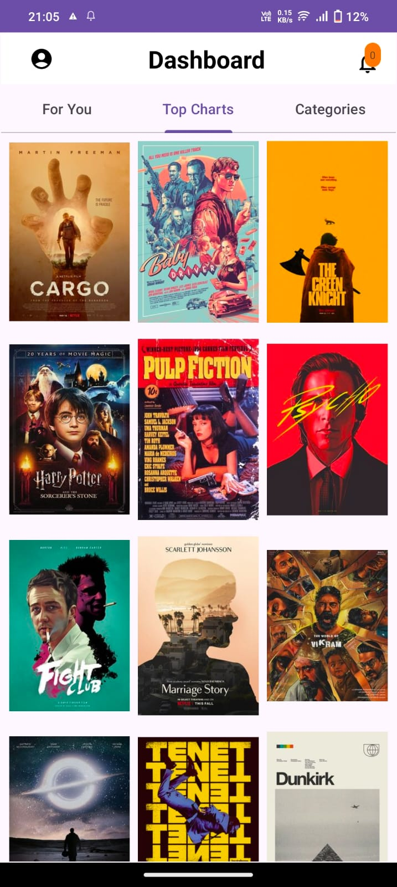
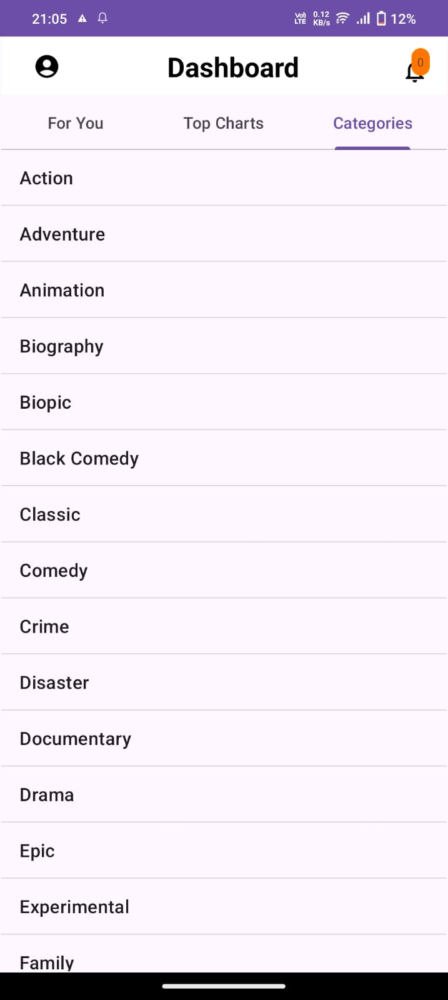

# MovieTime Project - MoveInSync

### Prototype Video Link
[Yotube Demonstration of Project](https://youtu.be/5nqKhz1FE6A?si=7WBatHQc0PCuw8RD)
### API Mocky Link
[Yotube Demonstration of Project](https://run.mocky.io/v3/9ba4ce56-e933-4e43-97ae-a3caa234d80c)

## Project Description
MovieTime is a movie recommendation and browsing application that allows users to explore a wide range of movies across various genres. With MovieTime, users can discover trending movies, explore different categories, and find detailed information about their favorite films. The application provides an intuitive interface and seamless navigation, ensuring an enjoyable experience for movie enthusiasts.

MovieTime makes use of the Retrofit library to fetch movie data from a remote API, allowing users to access the latest information about movies. The application integrates various features such as browsing trending movies, exploring movies by categories, viewing detailed information about each movie, saving favorite movies to a watchlist, and searching for specific movies using keywords. By leveraging Retrofit, MoveInSync efficiently handles network requests and retrieves movie data in a fast and reliable manner.

## Tech Stacks Included
MovieTime is built using the following technologies:
- **Android**: The application is developed for the Android platform, making use of Android Studio for development.
- **Kotlin**: The primary programming language used for building the app, providing modern features and improved code readability.
- **XML**: Used for designing the user interface layout of the application screens.
- **Retrofit**: Utilized to handle network requests and fetch movie data from a remote API.
- **Glide**: Employed for efficient loading and displaying of movie images within the application.

## Images and Prototypes
Below are some images and GIFs showcasing the prototype project:

### Prototype Images

## Features
- Browse trending movies.
- Explore movies by categories such as Action & Adventure, Romance, Horror, etc.
- View detailed information about each movie, including synopsis, cast, and ratings.
- Save favorite movies to a watchlist for later viewing.
- Search for specific movies using keywords.

## Major Components
- **Retrofit Service**: Defines API endpoints and methods for fetching movie data from the remote server.
- **Movie Service Interface**: Specifies the Retrofit service interface with methods for fetching movie data.
- **Movie Repository**: Manages data retrieval and provides access to movie-related information throughout the application.
- **Movie Model**: Represents the structure of movie data obtained from the API, including attributes such as title, overview, release date, etc.
- **Movie Adapter**: Handles the binding of movie data to UI components for display.
